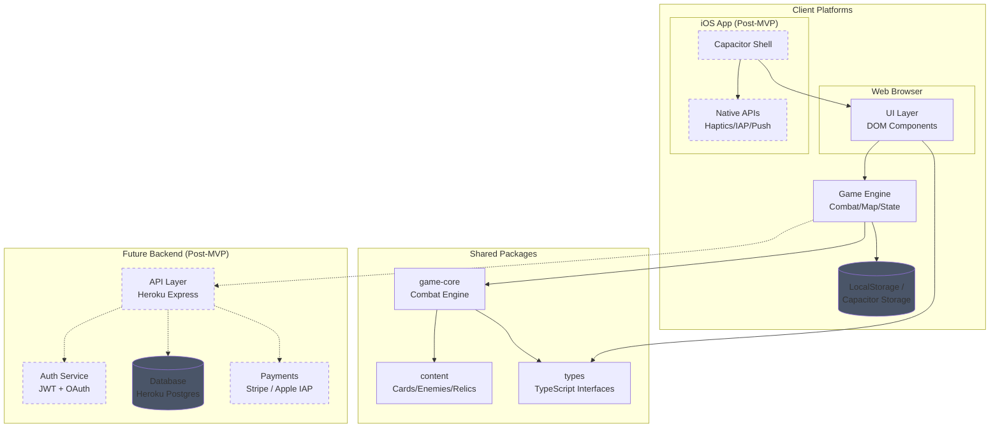
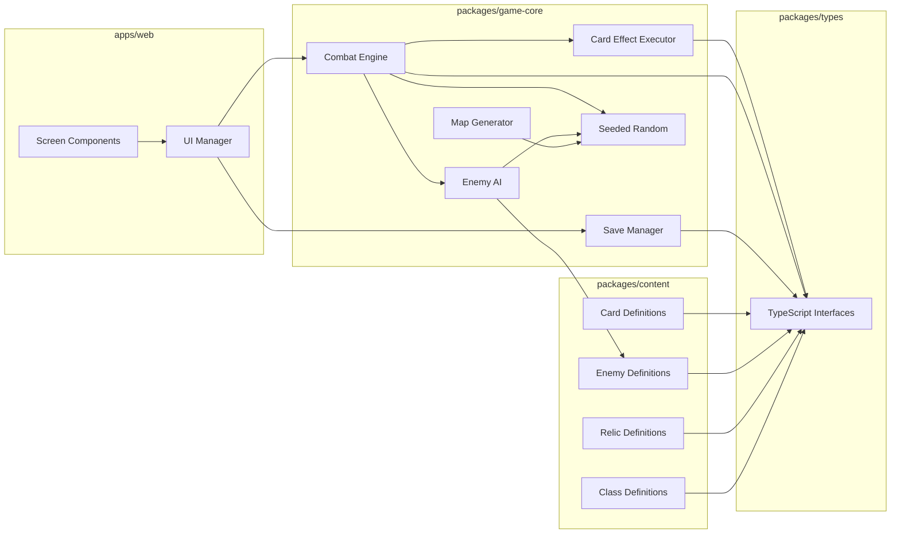
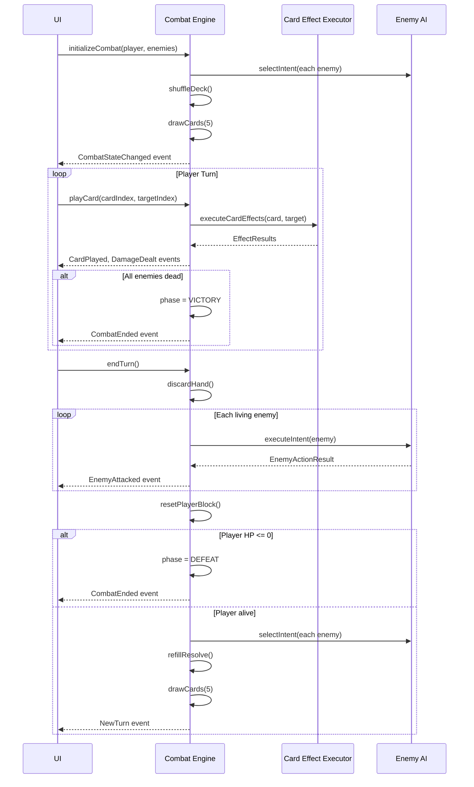
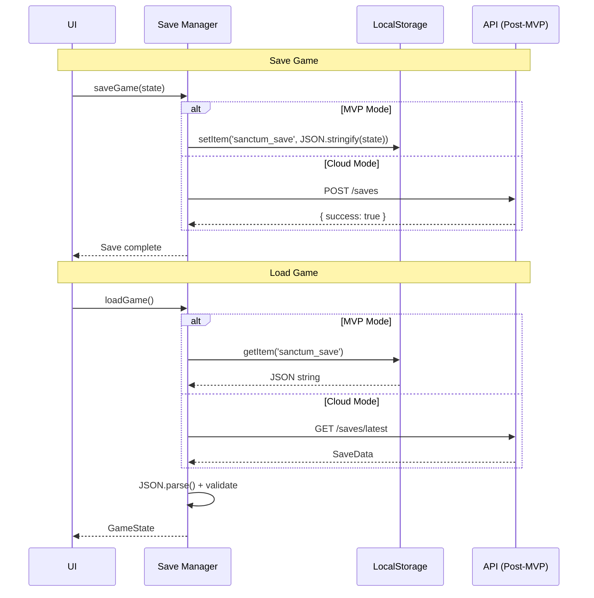
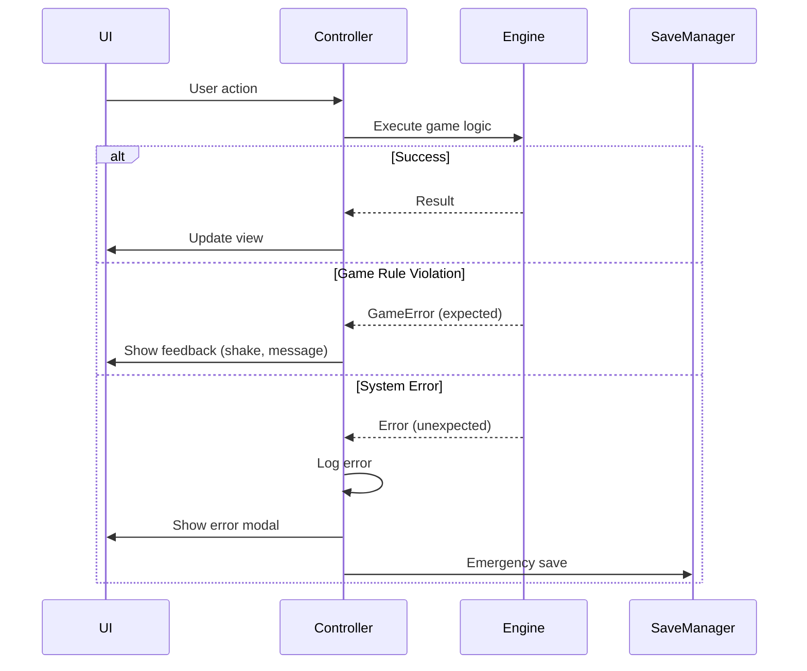

# Sanctum Ruins Fullstack Architecture Document

## Introduction

This document outlines the complete fullstack architecture for **Sanctum Ruins**, a browser-based roguelike deck-builder game. It serves as the single source of truth for AI-driven development, ensuring consistency across the entire technology stack.

The architecture is designed for a phased approach:
- **MVP (Phase 1-3)**: Client-side game with LocalStorage persistence (Web)
- **Post-MVP (Phase 4-6)**: Add backend services for auth, cloud saves, payments, leaderboards, and **iOS app via Capacitor**

### Starter Template or Existing Project

**N/A - Greenfield project** with an existing HTML/JS prototype (`sanctum-deep-mobile.html`) that demonstrates core combat mechanics. The prototype will be refactored into the new TypeScript architecture.

### Change Log

| Date | Version | Description | Author |
|------|---------|-------------|--------|
| 2024-12-03 | 1.0 | Initial architecture document | Winston (Architect) |
| 2024-12-03 | 1.1 | Added iOS/Capacitor strategy for post-MVP | Winston (Architect) |
| 2024-12-05 | 1.2 | Updated backend to Heroku Postgres (was Supabase), added Epic 14 reference | Mary (Analyst) |

---

## High Level Architecture

### Technical Summary

Sanctum Ruins uses a **monorepo architecture** with TypeScript throughout, enabling code sharing between the game client and future backend services. The MVP is a client-side single-page application built with Vite and vanilla TypeScript (no framework), prioritizing fast load times and simple deployment. The game engine uses a state machine pattern with event-driven UI updates, designed for the turn-based combat system. Future phases will add a Node.js API layer for authentication, cloud saves, and payment processing via Stripe.

### Platform and Infrastructure Choice

**Platform:** Static hosting (Vercel/Netlify) for MVP, expanding to serverless functions and native mobile post-MVP

**Key Services:**
- **Heroku**: Backend API hosting with Express.js, Postgres database
- **Heroku Postgres** (Post-MVP): PostgreSQL database for user accounts and cloud saves
- **LocalStorage**: Primary persistence (browser-based saves, offline-first)
- **Stripe** (Post-MVP): Payment processing for DLC purchases
- **Capacitor** (Post-MVP): Native iOS app wrapper for App Store deployment
- **Apple App Store** (Post-MVP): iOS distribution with in-app purchases

**Deployment Regions:** Heroku US region, Vercel Edge for static assets

**Rationale:** Heroku provides simple deployment for Node.js APIs with integrated Postgres. The game uses an offline-first architecture where localStorage is primary storage and cloud sync is supplementary. This ensures 100% offline playability while enabling cross-device sync for logged-in users. See [Epic 14: Cloud Save & User Accounts](./stories/14.0-cloud-save-epic-overview.md) for detailed implementation plan.

**Authentication Strategy:**
- Google OAuth for quick sign-in
- Email/Password for universal access
- Guest mode (no account required) - full game playable without login
- Conflict resolution: Last-write-wins (timestamp-based)

### Repository Structure

**Structure:** Monorepo with npm workspaces

**Monorepo Tool:** npm workspaces (native, no additional tooling needed for project of this size)

**Package Organization:**
- `apps/web` - Game client application (Web + Capacitor iOS shell)
- `packages/game-core` - Game engine, combat logic, card effects (shared)
- `packages/content` - Card definitions, enemy data, relic data (shared)
- `packages/types` - TypeScript interfaces shared across packages
- `apps/api` (Post-MVP) - Backend API services
- `apps/web/ios` (Post-MVP) - Capacitor iOS native project

### High Level Architecture Diagram



### Architectural Patterns

- **State Machine Pattern:** Combat phases (DRAW, PLAYER_ACTION, ENEMY_ACTION, etc.) managed by explicit state machine - _Rationale:_ Turn-based games require precise phase control; state machines prevent invalid state transitions and make debugging easier

- **Event-Driven UI:** Game engine emits events, UI subscribes and re-renders - _Rationale:_ Decouples game logic from presentation; enables future rendering engine swap (DOM to Canvas)

- **Entity-Component Pattern (Lightweight):** Cards, enemies, and relics defined as data objects with effect arrays - _Rationale:_ Content-driven design allows adding new cards/enemies without code changes

- **Repository Pattern (Post-MVP):** Abstract data access behind interfaces - _Rationale:_ Easy to swap LocalStorage for API calls when backend is added

- **Seeded RNG:** Deterministic random using seed values - _Rationale:_ Enables shareable runs and replay debugging

---

## Tech Stack

### Technology Stack Table

| Category | Technology | Version | Purpose | Rationale |
|----------|------------|---------|---------|-----------|
| Frontend Language | TypeScript | 5.3+ | Type-safe game development | Catches bugs at compile time, excellent IDE support |
| Build Tool | Vite | 5.x | Development server and bundling | Fast HMR, native ESM, simple config |
| UI Rendering | Vanilla DOM | - | UI components | No framework overhead, full control, small bundle |
| State Management | Custom EventEmitter | - | Game state changes | Game-specific needs don't fit standard patterns |
| CSS | CSS Modules + CSS Variables | - | Scoped styling with theming | Simple, no runtime, good isolation |
| Backend Language | TypeScript | 5.3+ | API services (Post-MVP) | Same language as frontend, shared types |
| Backend Framework | Express.js | 4.x | API server (Post-MVP) | Simple, well-documented, Heroku-native |
| API Style | REST | - | Client-server communication | Simple, well-understood, sufficient for game needs |
| Database (MVP) | LocalStorage | - | Save game data | Browser-native, no setup required, offline-first |
| Database (Post-MVP) | Heroku Postgres | - | User data, cloud saves | Scalable tiers, integrated with Heroku |
| Authentication | JWT + Google OAuth | - | User accounts (Post-MVP) | Google for convenience, email/password for universal access |
| Testing | Vitest | 1.x | Unit and integration tests | Fast, Vite-native, Jest-compatible API |
| E2E Testing | Playwright | 1.x | End-to-end game testing | Cross-browser, reliable, good debugging |
| Linting | ESLint + Prettier | 8.x / 3.x | Code quality | Industry standard, TypeScript support |
| Bundler | Vite (Rollup) | 5.x | Production builds | Tree-shaking, code splitting |

---

## Data Models

### GameState

**Purpose:** Root state object containing all game data for a run

**Key Attributes:**
- `run`: RunState - Current run progression data
- `combat`: CombatState | null - Active combat state (null when not in combat)
- `meta`: MetaState - Player preferences, unlocks, statistics

```typescript
interface GameState {
  run: RunState | null;
  combat: CombatState | null;
  meta: MetaState;
}
```

**Relationships:**
- Contains one optional RunState (null when no active run)
- Contains one optional CombatState (null when not in combat)
- Contains one MetaState (always present)

---

### RunState

**Purpose:** Persistent state for a single dungeon run

**Key Attributes:**
- `seed`: string - Deterministic RNG seed for the run
- `character`: CharacterClass - Selected class (cleric, knight, etc.)
- `deck`: Card[] - Current deck composition
- `currentAct`: number - Current act (1-3)
- `currentNode`: number - Current position on map
- `gold`: number - Currency for merchant
- `potions`: Potion[] - Held potions (max 3)
- `relics`: Relic[] - Collected passive items
- `currentHP`: number - Current health
- `maxHP`: number - Maximum health
- `floorMap`: MapNode[][] - Generated map structure
- `visitedNodes`: string[] - Nodes already visited

```typescript
interface RunState {
  seed: string;
  character: CharacterClass;
  deck: Card[];
  currentAct: 1 | 2 | 3;
  currentNode: number;
  gold: number;
  potions: Potion[];
  relics: Relic[];
  currentHP: number;
  maxHP: number;
  floorMap: MapNode[][];
  visitedNodes: string[];
}
```

**Relationships:**
- References one CharacterClass
- Contains array of Card instances
- Contains array of Potion instances
- Contains array of Relic instances
- Contains 2D array of MapNode for floor layout

---

### CombatState

**Purpose:** State for an active combat encounter

**Key Attributes:**
- `turn`: number - Current turn number
- `phase`: CombatPhase - Current phase of combat
- `player`: PlayerCombatState - Player's combat-specific state
- `enemies`: EnemyState[] - Array of enemies in combat

```typescript
interface CombatState {
  turn: number;
  phase: CombatPhase;
  player: PlayerCombatState;
  enemies: EnemyState[];
}

type CombatPhase =
  | 'DRAW'
  | 'PLAYER_ACTION'
  | 'END_TURN'
  | 'ENEMY_ACTION'
  | 'CLEANUP'
  | 'VICTORY'
  | 'DEFEAT';

interface PlayerCombatState {
  hp: number;
  maxHp: number;
  block: number;
  resolve: number;
  maxResolve: number;
  hand: Card[];
  drawPile: Card[];
  discardPile: Card[];
  exhaustPile: Card[];
  statusEffects: StatusEffect[];
  // Class-specific
  devotion?: number;  // Cleric
  fortify?: number;   // Dungeon Knight
}
```

**Relationships:**
- Contains one PlayerCombatState
- Contains array of EnemyState
- References CombatPhase enum

---

### Card

**Purpose:** Definition of a playable card

**Key Attributes:**
- `id`: string - Unique card definition ID
- `instanceId`: string - Unique instance ID (for deck tracking)
- `name`: string - Display name
- `type`: CardType - ATTACK, SKILL, POWER, CURSE
- `cost`: number - Resolve cost to play
- `effects`: CardEffect[] - Array of effects when played
- `rarity`: Rarity - COMMON, UNCOMMON, RARE

```typescript
interface Card {
  id: string;
  instanceId: string;
  name: string;
  type: CardType;
  cost: number;
  description: string;
  effects: CardEffect[];
  rarity: Rarity;
  upgraded?: boolean;
}

type CardType = 'ATTACK' | 'SKILL' | 'POWER' | 'CURSE';
type Rarity = 'STARTER' | 'COMMON' | 'UNCOMMON' | 'RARE';

interface CardEffect {
  type: EffectType;
  amount: number;
  target?: 'self' | 'enemy' | 'all_enemies';
}

type EffectType =
  | 'DAMAGE'
  | 'BLOCK'
  | 'HEAL'
  | 'APPLY_STATUS'
  | 'GAIN_DEVOTION'
  | 'GAIN_FORTIFY'
  | 'DRAW';
```

**Relationships:**
- Contains array of CardEffect
- Referenced by PlayerCombatState (hand, draw, discard, exhaust piles)
- Referenced by RunState (deck)

---

### EnemyState

**Purpose:** State of an enemy in combat

**Key Attributes:**
- `id`: string - Enemy type ID
- `instanceId`: string - Unique instance for this combat
- `name`: string - Display name
- `hp`: number - Current health
- `maxHp`: number - Maximum health
- `block`: number - Current block
- `intent`: EnemyIntent - Telegraphed next action

```typescript
interface EnemyState {
  id: string;
  instanceId: string;
  name: string;
  hp: number;
  maxHp: number;
  block: number;
  intent: EnemyIntent | null;
  statusEffects: StatusEffect[];
}

interface EnemyIntent {
  type: 'ATTACK' | 'DEFEND' | 'BUFF' | 'DEBUFF';
  value: number;
  name: string;
}
```

**Relationships:**
- References EnemyIntent for telegraphing
- Contains array of StatusEffect

---

### CharacterClass

**Purpose:** Definition of a playable character class

```typescript
interface CharacterClass {
  id: string;
  name: string;
  maxHp: number;
  maxResolve: number;
  classMechanic: 'devotion' | 'fortify' | 'contracts' | 'vows' | 'whimsy';
  starterDeck: { cardId: string; count: number }[];
  isPremium: boolean;
}
```

**Relationships:**
- Referenced by RunState
- Defines starting deck composition via cardId references

---

## API Specification

### MVP: No API Required

For MVP (Phases 1-3), all game logic runs client-side with LocalStorage persistence. No API endpoints are needed.

### Post-MVP REST API (Heroku Express)

> **Note:** Detailed API implementation is documented in [Epic 14: Cloud Save & User Accounts](./stories/14.0-cloud-save-epic-overview.md). See individual story cards for endpoint specifications.

**Base URL:** `https://sanctum-ruins.herokuapp.com/api`

**Authentication Endpoints:**
| Method | Endpoint | Auth | Description |
|--------|----------|------|-------------|
| POST | /auth/register | No | Create account with email/password |
| POST | /auth/login | No | Login with email/password |
| GET | /auth/google | No | Initiate Google OAuth flow |
| GET | /auth/google/callback | No | Google OAuth callback |
| POST | /auth/refresh | No | Refresh access token |
| POST | /auth/logout | Yes | Revoke refresh token |

**Sync Endpoints:**
| Method | Endpoint | Auth | Description |
|--------|----------|------|-------------|
| GET | /sync/pull | Yes | Get cloud save data |
| POST | /sync/push | Yes | Upload save to cloud |

**Purchase Endpoints:**
| Method | Endpoint | Auth | Description |
|--------|----------|------|-------------|
| GET | /purchases | Yes | Get user's purchased DLC |
| POST | /purchases/checkout | Yes | Create Stripe checkout session |

**Leaderboards:** Not implemented (out of scope per brainstorming session).

```yaml
openapi: 3.0.0
info:
  title: Sanctum Ruins API
  version: 1.0.0
  description: Backend API for cloud saves, auth, and payments

servers:
  - url: https://sanctum-ruins.herokuapp.com/api
    description: Production API (Heroku)

paths:
  /auth/register:
    post:
      summary: Create account with email/password
      tags: [Auth]
      requestBody:
        content:
          application/json:
            schema:
              type: object
              required: [email, password, displayName]
              properties:
                email: { type: string, format: email }
                password: { type: string, minLength: 8 }
                displayName: { type: string, maxLength: 50 }
      responses:
        201:
          description: Account created, JWT tokens returned

  /auth/login:
    post:
      summary: Login with email/password
      tags: [Auth]
      requestBody:
        content:
          application/json:
            schema:
              type: object
              required: [email, password]
              properties:
                email: { type: string, format: email }
                password: { type: string }
      responses:
        200:
          description: JWT tokens returned

  /sync/pull:
    get:
      summary: Get cloud save data
      tags: [Sync]
      security: [bearerAuth: []]
      responses:
        200:
          description: Compressed save data
        404:
          description: No cloud save exists

  /sync/push:
    post:
      summary: Upload save to cloud
      tags: [Sync]
      security: [bearerAuth: []]
      requestBody:
        content:
          application/json:
            schema:
              type: object
              properties:
                data: { type: string, description: "LZ-compressed JSON" }
                timestamp: { type: integer, description: "JS timestamp" }
      responses:
        200:
          description: Save uploaded successfully

  /purchases:
    get:
      summary: Get user's purchased DLC
      tags: [Purchases]
      security: [bearerAuth: []]

    post:
      summary: Create checkout session
      tags: [Purchases]
      security: [bearerAuth: []]
      requestBody:
        content:
          application/json:
            schema:
              type: object
              properties:
                classId: { type: string, enum: [diabolist, oathbound, fey_touched] }
```

---

## Components

### Combat Engine

**Responsibility:** Manages all combat state transitions, turn flow, card effects, and damage calculations

**Key Interfaces:**
- `initializeCombat(player: RunState, enemies: EnemyDefinition[]): CombatState`
- `playCard(cardIndex: number, targetIndex?: number): PlayCardResult`
- `endTurn(): EndTurnResult`
- `subscribe(callback: (event: CombatEvent) => void): () => void`
- `getState(): CombatState`

**Dependencies:** types, content (card definitions)

**Technology Stack:** Pure TypeScript, no external dependencies

---

### Card Effect Executor

**Responsibility:** Executes card effects in proper order, handles targeting, applies damage/block/healing

**Key Interfaces:**
- `executeCardEffects(card: Card, target?: EnemyState): EffectResult[]`
- `dealDamage(target: EnemyState | PlayerCombatState, amount: number): DamageResult`
- `applyBlock(target: PlayerCombatState, amount: number): void`
- `heal(amount: number): HealResult`

**Dependencies:** types

**Technology Stack:** Pure TypeScript

---

### Enemy AI

**Responsibility:** Selects enemy intents based on weighted random, executes enemy actions

**Key Interfaces:**
- `selectIntent(enemy: EnemyState): EnemyIntent`
- `executeEnemyTurn(enemies: EnemyState[]): EnemyActionResult[]`

**Dependencies:** types, content (enemy definitions), seeded-random

**Technology Stack:** Pure TypeScript

---

### Map Generator

**Responsibility:** Procedurally generates floor maps with guaranteed node distribution

**Key Interfaces:**
- `generateFloor(act: number, seed: string): MapNode[][]`
- `getAvailableNodes(currentNode: number, floor: MapNode[][]): MapNode[]`

**Dependencies:** types, seeded-random

**Technology Stack:** Pure TypeScript

---

### Save Manager

**Responsibility:** Persists and loads game state to/from LocalStorage (MVP) or API (Post-MVP)

**Key Interfaces:**
- `saveGame(state: GameState): Promise<void>`
- `loadGame(): Promise<GameState | null>`
- `deleteSave(): Promise<void>`
- `hasSave(): boolean`

**Dependencies:** types

**Technology Stack:** LocalStorage API (MVP), Capacitor Preferences API (iOS), fetch API (Post-MVP)

---

### Seeded Random

**Responsibility:** Provides deterministic random number generation for reproducible runs

**Key Interfaces:**
- `createRng(seed: string): SeededRng`
- `SeededRng.next(): number` (0-1)
- `SeededRng.nextInt(min: number, max: number): number`
- `SeededRng.shuffle<T>(array: T[]): T[]`
- `SeededRng.weightedChoice<T>(items: T[], weights: number[]): T`

**Dependencies:** None

**Technology Stack:** Pure TypeScript (mulberry32 or similar algorithm)

---

### UI Manager

**Responsibility:** Renders game state to DOM, handles user input, subscribes to game events

**Key Interfaces:**
- `render(state: GameState): void`
- `bindEvents(engine: CombatEngine): void`
- `showScreen(screen: ScreenType): void`

**Dependencies:** Combat Engine, types

**Technology Stack:** Vanilla DOM manipulation, CSS Modules

---

### Component Diagram



---

## Core Workflows

### Combat Flow Sequence



### Save/Load Flow



---

## Database Schema

### MVP: LocalStorage Structure

```typescript
// Key: 'sanctum_save'
interface LocalStorageSave {
  version: number;  // Schema version for migrations
  savedAt: string;  // ISO timestamp
  gameState: GameState;
}

// Key: 'sanctum_meta'
interface LocalStorageMeta {
  version: number;
  settings: {
    musicVolume: number;
    sfxVolume: number;
    animationSpeed: 'fast' | 'normal' | 'slow';
  };
  statistics: {
    totalRuns: number;
    totalWins: number;
    totalPlayTime: number;
    classStats: Record<string, { runs: number; wins: number }>;
  };
  unlocks: {
    purchasedClasses: string[];
  };
}
```

### Post-MVP: PostgreSQL Schema

```sql
-- Users table (managed by Supabase Auth)
-- Additional user data
CREATE TABLE user_profiles (
  id UUID PRIMARY KEY REFERENCES auth.users(id),
  display_name TEXT,
  created_at TIMESTAMPTZ DEFAULT NOW(),
  last_login TIMESTAMPTZ
);

-- Cloud saves
CREATE TABLE saves (
  id UUID PRIMARY KEY DEFAULT gen_random_uuid(),
  user_id UUID REFERENCES auth.users(id) NOT NULL,
  slot INTEGER NOT NULL DEFAULT 1,
  game_state JSONB NOT NULL,
  character_class TEXT NOT NULL,
  current_act INTEGER NOT NULL,
  current_hp INTEGER NOT NULL,
  saved_at TIMESTAMPTZ DEFAULT NOW(),
  UNIQUE(user_id, slot)
);

CREATE INDEX idx_saves_user ON saves(user_id);

-- Purchases (DLC ownership)
CREATE TABLE purchases (
  id UUID PRIMARY KEY DEFAULT gen_random_uuid(),
  user_id UUID REFERENCES auth.users(id) NOT NULL,
  class_id TEXT NOT NULL,
  stripe_payment_id TEXT,
  purchased_at TIMESTAMPTZ DEFAULT NOW(),
  UNIQUE(user_id, class_id)
);

CREATE INDEX idx_purchases_user ON purchases(user_id);

-- Leaderboards
CREATE TABLE leaderboard_entries (
  id UUID PRIMARY KEY DEFAULT gen_random_uuid(),
  user_id UUID REFERENCES auth.users(id) NOT NULL,
  character_class TEXT NOT NULL,
  score INTEGER NOT NULL,
  run_time_seconds INTEGER NOT NULL,
  seed TEXT NOT NULL,
  submitted_at TIMESTAMPTZ DEFAULT NOW()
);

CREATE INDEX idx_leaderboard_score ON leaderboard_entries(score DESC);
CREATE INDEX idx_leaderboard_time ON leaderboard_entries(run_time_seconds ASC);
```

---

## Frontend Architecture

### Component Organization

```
apps/web/src/
├── components/
│   ├── combat/
│   │   ├── CombatView.ts         # Main combat screen
│   │   ├── EnemyArea.ts          # Enemy display container
│   │   ├── EnemyCard.ts          # Single enemy display
│   │   ├── PlayerStats.ts        # HP/Block/Resolve display
│   │   ├── Hand.ts               # Card hand container
│   │   ├── CardComponent.ts      # Single card display
│   │   └── CombatLog.ts          # Action log
│   ├── map/
│   │   ├── MapView.ts            # Map screen
│   │   └── MapNode.ts            # Single node
│   ├── screens/
│   │   ├── MainMenu.ts
│   │   ├── ClassSelect.ts
│   │   ├── VictoryScreen.ts
│   │   ├── DefeatScreen.ts
│   │   └── SettingsScreen.ts
│   └── shared/
│       ├── Button.ts
│       ├── Modal.ts
│       └── HealthBar.ts
├── styles/
│   ├── variables.css             # CSS custom properties
│   ├── components/               # Component-specific styles
│   └── screens/                  # Screen-specific styles
├── services/
│   ├── GameController.ts         # Orchestrates game flow
│   └── AudioManager.ts           # Sound effects (Phase 5)
└── main.ts                       # Entry point
```

### Component Template

```typescript
// Example: components/combat/CardComponent.ts

export interface CardComponentProps {
  card: Card;
  isPlayable: boolean;
  onPlay: (card: Card) => void;
}

export function createCardComponent(props: CardComponentProps): HTMLElement {
  const el = document.createElement('div');
  el.className = `card card--${props.card.type.toLowerCase()} ${props.isPlayable ? '' : 'card--unplayable'}`;

  el.innerHTML = `
    <div class="card__cost">${props.card.cost}</div>
    <div class="card__name">${props.card.name}</div>
    <div class="card__type">${props.card.type}</div>
    <div class="card__description">${props.card.description}</div>
  `;

  if (props.isPlayable) {
    el.addEventListener('click', () => props.onPlay(props.card));
  }

  return el;
}

export function updateCardComponent(el: HTMLElement, props: CardComponentProps): void {
  el.className = `card card--${props.card.type.toLowerCase()} ${props.isPlayable ? '' : 'card--unplayable'}`;
  // Update content if needed
}
```

### State Management Architecture

```typescript
// services/GameController.ts

import { EventEmitter } from '../utils/EventEmitter';
import { CombatEngine } from '@sanctum/game-core';
import type { GameState, GameEvent } from '@sanctum/types';

export class GameController extends EventEmitter<GameEvent> {
  private state: GameState;
  private combatEngine: CombatEngine | null = null;

  constructor() {
    super();
    this.state = this.loadOrCreateState();
  }

  // State access
  getState(): Readonly<GameState> {
    return this.state;
  }

  // Game flow
  startNewRun(classId: string): void {
    // Initialize run state
    this.emit('RUN_STARTED', { classId });
  }

  enterCombat(enemies: EnemyDefinition[]): void {
    this.combatEngine = new CombatEngine(/* ... */);
    this.combatEngine.subscribe((event) => {
      // Forward combat events
      this.emit(event.type, event.data);
    });
  }

  // Persistence
  save(): void {
    localStorage.setItem('sanctum_save', JSON.stringify({
      version: 1,
      savedAt: new Date().toISOString(),
      gameState: this.state
    }));
  }
}
```

### State Management Patterns

- Single source of truth in GameController
- Immutable state access via getState()
- Event-driven updates (no direct state mutation)
- Component subscription to relevant events only
- Automatic save on significant state changes

### Routing Architecture

```typescript
// Simple hash-based routing for SPA

type Screen =
  | 'main-menu'
  | 'class-select'
  | 'map'
  | 'combat'
  | 'campfire'
  | 'merchant'
  | 'reward'
  | 'victory'
  | 'defeat'
  | 'settings';

class Router {
  private currentScreen: Screen = 'main-menu';
  private screenContainer: HTMLElement;

  constructor(container: HTMLElement) {
    this.screenContainer = container;
    window.addEventListener('hashchange', () => this.handleRoute());
  }

  navigate(screen: Screen, params?: Record<string, unknown>): void {
    window.location.hash = screen;
    this.renderScreen(screen, params);
  }

  private handleRoute(): void {
    const screen = window.location.hash.slice(1) as Screen || 'main-menu';
    this.renderScreen(screen);
  }

  private renderScreen(screen: Screen, params?: Record<string, unknown>): void {
    this.screenContainer.innerHTML = '';
    const screenComponent = this.getScreenComponent(screen);
    this.screenContainer.appendChild(screenComponent);
    this.currentScreen = screen;
  }
}
```

---

## Backend Architecture (Post-MVP)

> **Note:** Detailed backend implementation is documented in [Epic 14: Cloud Save & User Accounts](./stories/14.0-cloud-save-epic-overview.md).

### Express.js API Organization (Heroku)

```
server/
├── src/
│   ├── index.ts              # Entry point, Express app
│   ├── config.ts             # Environment configuration
│   ├── db.ts                 # Postgres connection pool
│   ├── routes/
│   │   ├── auth.ts           # /api/auth/* endpoints
│   │   ├── sync.ts           # /api/sync/* endpoints
│   │   ├── purchases.ts      # /api/purchases/* endpoints
│   │   └── health.ts         # /api/health endpoint
│   ├── middleware/
│   │   ├── auth.ts           # JWT verification
│   │   ├── cors.ts           # CORS configuration
│   │   ├── rateLimit.ts      # Rate limiting
│   │   └── errorHandler.ts   # Error handling
│   ├── services/
│   │   ├── userService.ts    # User CRUD operations
│   │   ├── tokenService.ts   # JWT generation/validation
│   │   ├── saveService.ts    # Save data operations
│   │   └── stripe.ts         # Stripe client
│   └── types/
│       └── index.ts          # Shared types
├── package.json
├── tsconfig.json
└── Procfile                  # Heroku deployment
```

### Route Handler Template

```typescript
// server/src/routes/sync.ts

import { Router } from 'express';
import { authMiddleware, AuthRequest } from '../middleware/auth';
import { saveService } from '../services/saveService';

const router = Router();

// GET /api/sync/pull - Get cloud save
router.get('/pull', authMiddleware, async (req: AuthRequest, res) => {
  try {
    const saveData = await saveService.getSaveData(req.user!.userId);

    if (!saveData) {
      return res.status(404).json({ error: 'No cloud save found' });
    }

    res.json({
      data: saveData.data,
      timestamp: saveData.lastSaved
    });
  } catch (error) {
    console.error('Failed to pull save:', error);
    res.status(500).json({ error: 'Failed to retrieve save' });
  }
});

// POST /api/sync/push - Upload save to cloud
router.post('/push', authMiddleware, async (req: AuthRequest, res) => {
  const { data, timestamp } = req.body;

  try {
    await saveService.upsertSaveData(req.user!.userId, data, timestamp);
    res.json({ success: true });
  } catch (error) {
    console.error('Failed to push save:', error);
    res.status(500).json({ error: 'Failed to save' });
  }
});

export { router as syncRouter };
```

---

## iOS / Mobile Architecture (Post-MVP)

### Capacitor Integration

Capacitor wraps the existing web application in a native iOS shell, providing access to native APIs while reusing 100% of the game logic and UI code.

**Why Capacitor:**
- Same codebase for web and iOS (no React Native rewrite)
- Full access to native iOS APIs (haptics, in-app purchases, push notifications)
- App Store deployment with native performance
- Maintained by Ionic team with strong community support

### iOS Project Structure

```
apps/web/
├── ios/                           # Capacitor iOS project (generated)
│   ├── App/
│   │   ├── App/
│   │   │   ├── AppDelegate.swift
│   │   │   ├── Info.plist
│   │   │   └── capacitor.config.json
│   │   └── App.xcodeproj
│   └── Podfile
├── capacitor.config.ts            # Capacitor configuration
└── src/
    └── native/                    # Native bridge utilities
        ├── platform.ts            # Platform detection
        ├── haptics.ts             # Haptic feedback wrapper
        ├── storage.ts             # Capacitor Preferences wrapper
        └── purchases.ts           # In-app purchase wrapper
```

### Capacitor Configuration

```typescript
// apps/web/capacitor.config.ts
import { CapacitorConfig } from '@capacitor/cli';

const config: CapacitorConfig = {
  appId: 'com.sanctumruins.app',
  appName: 'Sanctum Ruins',
  webDir: 'dist',
  server: {
    // For development, can use live reload
    // url: 'http://localhost:5173',
    // cleartext: true
  },
  ios: {
    contentInset: 'automatic',
    preferredContentMode: 'mobile',
    scheme: 'Sanctum Ruins'
  },
  plugins: {
    SplashScreen: {
      launchShowDuration: 2000,
      backgroundColor: '#1a1a2e',
      showSpinner: false
    },
    Keyboard: {
      resize: 'body',
      resizeOnFullScreen: true
    }
  }
};

export default config;
```

### Native API Abstractions

```typescript
// src/native/platform.ts
import { Capacitor } from '@capacitor/core';

export const isNative = Capacitor.isNativePlatform();
export const isIOS = Capacitor.getPlatform() === 'ios';
export const isWeb = Capacitor.getPlatform() === 'web';

// src/native/haptics.ts
import { Haptics, ImpactStyle } from '@capacitor/haptics';
import { isNative } from './platform';

export async function cardPlayHaptic(): Promise<void> {
  if (isNative) {
    await Haptics.impact({ style: ImpactStyle.Light });
  }
}

export async function damageHaptic(): Promise<void> {
  if (isNative) {
    await Haptics.impact({ style: ImpactStyle.Heavy });
  }
}

export async function victoryHaptic(): Promise<void> {
  if (isNative) {
    await Haptics.notification({ type: 'SUCCESS' });
  }
}

// src/native/storage.ts
import { Preferences } from '@capacitor/preferences';
import { isNative } from './platform';

export async function saveData(key: string, value: string): Promise<void> {
  if (isNative) {
    await Preferences.set({ key, value });
  } else {
    localStorage.setItem(key, value);
  }
}

export async function loadData(key: string): Promise<string | null> {
  if (isNative) {
    const { value } = await Preferences.get({ key });
    return value;
  }
  return localStorage.getItem(key);
}
```

### In-App Purchases (DLC Classes)

```typescript
// src/native/purchases.ts
import { isIOS } from './platform';

// Using capacitor-community/in-app-purchases or RevenueCat
interface PurchaseResult {
  success: boolean;
  productId: string;
  transactionId?: string;
}

const PRODUCT_IDS = {
  diabolist: 'com.sanctumruins.class.diabolist',
  oathbound: 'com.sanctumruins.class.oathbound',
  fey_touched: 'com.sanctumruins.class.feytouched',
  class_bundle: 'com.sanctumruins.bundle.allclasses'
};

export async function purchaseClass(classId: string): Promise<PurchaseResult> {
  if (isIOS) {
    // iOS In-App Purchase flow
    const productId = PRODUCT_IDS[classId];
    // Implementation depends on chosen IAP library
    // RevenueCat recommended for simplicity
    return await initiateIOSPurchase(productId);
  } else {
    // Web: Redirect to Stripe checkout
    return await initiateStripePurchase(classId);
  }
}

export async function restorePurchases(): Promise<string[]> {
  if (isIOS) {
    // Restore iOS purchases
    return await restoreIOSPurchases();
  }
  // Web: Check with backend
  return await fetchPurchasedClasses();
}
```

### iOS-Specific Considerations

| Concern | Solution |
|---------|----------|
| **Safe Area** | CSS `env(safe-area-inset-*)` for notch/home indicator |
| **Keyboard** | Capacitor Keyboard plugin for input handling |
| **Status Bar** | Dark content on game screens, handled in AppDelegate |
| **App Icons** | 1024x1024 master icon, Xcode generates all sizes |
| **Launch Screen** | Storyboard with game logo, matches splash config |
| **Offline Play** | Full offline support (game is client-side) |
| **Background** | Save game state on `appStateChange` event |

### iOS Build & Deployment Commands

```bash
# One-time setup
npm install @capacitor/core @capacitor/ios @capacitor/cli
npx cap init "Sanctum Ruins" com.sanctumruins.app
npx cap add ios

# Development cycle
npm run build --workspace=apps/web    # Build web assets
npx cap sync ios                       # Sync to iOS project
npx cap open ios                       # Open in Xcode

# Or run directly
npx cap run ios                        # Build and run on simulator

# Production build
# 1. Build web: npm run build --workspace=apps/web
# 2. Sync: npx cap sync ios
# 3. Open Xcode: npx cap open ios
# 4. Archive: Product → Archive
# 5. Upload to App Store Connect
```

### Required Capacitor Plugins

| Plugin | Purpose | Phase |
|--------|---------|-------|
| `@capacitor/preferences` | Native storage (replaces localStorage) | MVP iOS |
| `@capacitor/haptics` | Haptic feedback on card plays, damage | MVP iOS |
| `@capacitor/splash-screen` | Native splash screen | MVP iOS |
| `@capacitor/keyboard` | Keyboard handling for any text input | MVP iOS |
| `@capacitor/app` | App lifecycle events (save on background) | MVP iOS |
| `capacitor-community/in-app-purchases` or RevenueCat | DLC purchases | Post-MVP |
| `@capacitor/push-notifications` | Daily challenge notifications | Future |

---

## Unified Project Structure

```
sanctum-ruins/
├── .github/
│   └── workflows/
│       ├── ci.yaml                 # Lint, typecheck, test on PR
│       └── deploy.yaml             # Deploy to Vercel on main
├── apps/
│   ├── web/                        # Frontend game client
│   │   ├── src/
│   │   │   ├── components/         # UI components
│   │   │   ├── screens/            # Screen components
│   │   │   ├── services/           # GameController, AudioManager
│   │   │   ├── styles/             # CSS files
│   │   │   ├── utils/              # Frontend utilities
│   │   │   └── main.ts             # Entry point
│   │   ├── public/
│   │   │   ├── assets/             # Images, sounds (Phase 5)
│   │   │   └── index.html
│   │   ├── tests/
│   │   ├── vite.config.ts
│   │   ├── tsconfig.json
│   │   └── package.json
│   └── api/                        # Backend (Post-MVP)
│       ├── src/
│       │   ├── functions/
│       │   ├── middleware/
│       │   └── services/
│       ├── tests/
│       ├── tsconfig.json
│       ├── vercel.json
│       └── package.json
├── packages/
│   ├── game-core/                  # Game engine
│   │   ├── src/
│   │   │   ├── combat/
│   │   │   │   ├── CombatEngine.ts
│   │   │   │   ├── CardEffects.ts
│   │   │   │   └── EnemyAI.ts
│   │   │   ├── map/
│   │   │   │   └── MapGenerator.ts
│   │   │   ├── save/
│   │   │   │   └── SaveManager.ts
│   │   │   ├── utils/
│   │   │   │   ├── SeededRandom.ts
│   │   │   │   └── EventEmitter.ts
│   │   │   └── index.ts
│   │   ├── tests/
│   │   ├── tsconfig.json
│   │   └── package.json
│   ├── content/                    # Game content definitions
│   │   ├── src/
│   │   │   ├── cards/
│   │   │   │   ├── cleric.ts
│   │   │   │   ├── knight.ts
│   │   │   │   └── index.ts
│   │   │   ├── enemies/
│   │   │   │   ├── act1.ts
│   │   │   │   ├── act2.ts
│   │   │   │   ├── act3.ts
│   │   │   │   └── index.ts
│   │   │   ├── relics/
│   │   │   │   └── index.ts
│   │   │   ├── classes/
│   │   │   │   └── index.ts
│   │   │   └── index.ts
│   │   ├── tsconfig.json
│   │   └── package.json
│   └── types/                      # Shared TypeScript interfaces
│       ├── src/
│       │   ├── game.ts             # GameState, RunState, etc.
│       │   ├── combat.ts           # CombatState, Card, Enemy
│       │   ├── content.ts          # Definition types
│       │   ├── events.ts           # Event types
│       │   └── index.ts
│       ├── tsconfig.json
│       └── package.json
├── docs/
│   ├── brief.md
│   ├── architecture.md             # This document
│   ├── stories/                    # User stories
│   └── qa/                         # QA documents
├── .env.example
├── .eslintrc.js
├── .prettierrc
├── package.json                    # Root workspace config
├── tsconfig.base.json              # Shared TS config
└── README.md
```

---

## Development Workflow

### Prerequisites

```bash
# Required software
node --version  # v20.x or higher
npm --version   # v10.x or higher
```

### Initial Setup

```bash
# Clone and install
git clone <repo-url>
cd sanctum-ruins
npm install

# Build all packages
npm run build

# Start development
npm run dev
```

### Development Commands

```bash
# Start all services (frontend dev server)
npm run dev

# Start frontend only
npm run dev --workspace=apps/web

# Run tests (all packages)
npm test

# Run tests for specific package
npm test --workspace=packages/game-core

# Lint and typecheck
npm run lint
npm run typecheck

# Build for production
npm run build
```

### Environment Configuration

```bash
# apps/web/.env.local (MVP)
VITE_APP_VERSION=1.0.0

# apps/web/.env.local (Post-MVP)
VITE_SUPABASE_URL=https://xxx.supabase.co
VITE_SUPABASE_ANON_KEY=xxx
VITE_STRIPE_PUBLIC_KEY=pk_xxx

# apps/api/.env (Post-MVP)
SUPABASE_URL=https://xxx.supabase.co
SUPABASE_SERVICE_KEY=xxx
STRIPE_SECRET_KEY=sk_xxx
STRIPE_WEBHOOK_SECRET=whsec_xxx
```

---

## Deployment Architecture

### Deployment Strategy

**Frontend Deployment:**
- **Platform:** Vercel
- **Build Command:** `npm run build --workspace=apps/web`
- **Output Directory:** `apps/web/dist`
- **CDN/Edge:** Automatic Vercel Edge Network

**Backend Deployment (Post-MVP):**
- **Platform:** Vercel Serverless Functions
- **Build Command:** Automatic (Vercel detects functions)
- **Deployment Method:** Git push to main branch

**iOS Deployment (Post-MVP):**
- **Platform:** Apple App Store
- **Build Tool:** Capacitor + Xcode
- **Build Command:** `npm run build --workspace=apps/web && npx cap sync ios`
- **Deployment Method:** Xcode Archive → App Store Connect → TestFlight → Release

### CI/CD Pipeline

```yaml
# .github/workflows/ci.yaml
name: CI

on:
  pull_request:
    branches: [main]

jobs:
  validate:
    runs-on: ubuntu-latest
    steps:
      - uses: actions/checkout@v4
      - uses: actions/setup-node@v4
        with:
          node-version: '20'
          cache: 'npm'

      - run: npm ci
      - run: npm run lint
      - run: npm run typecheck
      - run: npm test
      - run: npm run build

# .github/workflows/deploy.yaml
name: Deploy

on:
  push:
    branches: [main]

jobs:
  deploy:
    runs-on: ubuntu-latest
    steps:
      - uses: actions/checkout@v4
      - uses: amondnet/vercel-action@v25
        with:
          vercel-token: ${{ secrets.VERCEL_TOKEN }}
          vercel-org-id: ${{ secrets.VERCEL_ORG_ID }}
          vercel-project-id: ${{ secrets.VERCEL_PROJECT_ID }}
          vercel-args: '--prod'
```

### Environments

| Environment | Frontend URL | Backend URL | Purpose |
|-------------|--------------|-------------|---------|
| Development | http://localhost:5173 | N/A (client-only MVP) | Local development |
| Preview | https://sanctum-xxx.vercel.app | Auto-provisioned | PR previews |
| Production | https://sanctumruins.com | https://api.sanctumruins.com | Live environment |

---

## Security and Performance

### Security Requirements

**Frontend Security:**
- CSP Headers: `default-src 'self'; script-src 'self'; style-src 'self' 'unsafe-inline'`
- XSS Prevention: No innerHTML with user data, sanitize all dynamic content
- Secure Storage: No sensitive data in localStorage, only game state

**Backend Security (Post-MVP):**
- Input Validation: Zod schemas for all API inputs
- Rate Limiting: 100 requests/minute per IP, 1000/hour per user
- CORS Policy: Allow only production frontend origin

**Authentication Security (Post-MVP):**
- Token Storage: HttpOnly cookies (not localStorage)
- Session Management: JWT with 1-hour expiry, refresh tokens
- Password Policy: Handled by Supabase Auth (8+ chars, complexity)

### Performance Optimization

**Frontend Performance:**
- Bundle Size Target: <100KB gzipped for initial load
- Loading Strategy: Lazy load audio assets, preload critical CSS
- Caching Strategy: Immutable assets with content hashing

**Backend Performance (Post-MVP):**
- Response Time Target: <200ms for API calls
- Database Optimization: Indexed queries, connection pooling via Supabase
- Caching Strategy: Edge caching for leaderboards (5-minute TTL)

---

## Testing Strategy

### Testing Pyramid

```
         E2E Tests
        /         \
    Integration Tests
   /                 \
  Frontend Unit    Backend Unit
 /                           \
Component Tests        API Tests
```

### Test Organization

**Frontend Tests:**
```
apps/web/tests/
├── components/
│   ├── CardComponent.test.ts
│   └── HealthBar.test.ts
├── screens/
│   └── CombatView.test.ts
└── services/
    └── GameController.test.ts
```

**Game Core Tests:**
```
packages/game-core/tests/
├── combat/
│   ├── CombatEngine.test.ts
│   ├── CardEffects.test.ts
│   └── EnemyAI.test.ts
├── map/
│   └── MapGenerator.test.ts
└── utils/
    └── SeededRandom.test.ts
```

**E2E Tests:**
```
e2e/
├── combat.spec.ts          # Full combat flow
├── run.spec.ts             # Complete run through Act 1
└── save-load.spec.ts       # Save/load functionality
```

### Test Examples

**Unit Test (Combat Engine):**
```typescript
// packages/game-core/tests/combat/CombatEngine.test.ts
import { describe, it, expect, beforeEach } from 'vitest';
import { CombatEngine } from '../../src/combat/CombatEngine';
import { CLERIC } from '@sanctum/content';

describe('CombatEngine', () => {
  let engine: CombatEngine;

  beforeEach(() => {
    engine = new CombatEngine({
      player: createTestPlayer(CLERIC),
      enemies: [createTestEnemy('cultist')],
      seed: 'test-seed'
    });
  });

  it('should refill resolve at start of turn', () => {
    const state = engine.getState();
    expect(state.player.resolve).toBe(3);

    // Play a card to reduce resolve
    engine.playCard(0, 0);
    expect(engine.getState().player.resolve).toBe(2);

    // End turn and start new one
    engine.endTurn();
    expect(engine.getState().player.resolve).toBe(3);
  });

  it('should reset block after enemy attacks', () => {
    // Gain block
    engine.playCard(/* shield card */, undefined);
    expect(engine.getState().player.block).toBe(5);

    // End turn - enemies attack, then block resets
    engine.endTurn();
    expect(engine.getState().player.block).toBe(0);
  });
});
```

**E2E Test:**
```typescript
// e2e/combat.spec.ts
import { test, expect } from '@playwright/test';

test('player can complete a combat encounter', async ({ page }) => {
  await page.goto('/');
  await page.click('text=New Game');
  await page.click('text=The Cleric');
  await page.click('text=Start Run');

  // First combat node
  await page.click('.map-node--combat');

  // Play cards until enemy dead
  while (await page.locator('.enemy:not(.enemy--dead)').count() > 0) {
    const playableCard = page.locator('.card:not(.card--unplayable)').first();
    if (await playableCard.count() > 0) {
      await playableCard.click();
      // If attack, select target
      if (await page.locator('.enemy--targetable').count() > 0) {
        await page.locator('.enemy--targetable').first().click();
      }
    } else {
      await page.click('text=End Turn');
    }
  }

  // Victory screen should appear
  await expect(page.locator('text=Victory')).toBeVisible();
});
```

---

## Coding Standards

### Critical Fullstack Rules

- **Type Sharing:** Always define types in `packages/types` and import from `@sanctum/types`
- **Game Logic Location:** All game logic must be in `packages/game-core`, never in UI components
- **No Direct DOM Manipulation in Game Core:** Game core is pure TypeScript, no browser APIs
- **Event-Driven Updates:** Never mutate state directly; use engine methods that emit events
- **Seeded Random Only:** Use `SeededRandom` for all random operations, never `Math.random()`
- **Content as Data:** Card/enemy/relic definitions are data, not code; no logic in content files
- **LocalStorage Abstraction:** Access storage only through `SaveManager`, never directly

### Naming Conventions

| Element | Frontend | Backend | Example |
|---------|----------|---------|---------|
| Components | PascalCase | - | `CardComponent.ts` |
| Screens | PascalCase + Screen | - | `CombatView.ts` |
| Services | PascalCase | PascalCase | `GameController.ts` |
| Types | PascalCase | PascalCase | `CombatState` |
| Functions | camelCase | camelCase | `playCard()` |
| Constants | SCREAMING_SNAKE | SCREAMING_SNAKE | `MAX_HAND_SIZE` |
| Event Types | SCREAMING_SNAKE | SCREAMING_SNAKE | `CARD_PLAYED` |
| CSS Classes | kebab-case + BEM | - | `.card--unplayable` |

---

## Error Handling Strategy

### Error Flow



### Error Response Format

```typescript
// Shared error types
interface GameError {
  type: 'GAME_ERROR';
  code: GameErrorCode;
  message: string;
}

type GameErrorCode =
  | 'INSUFFICIENT_RESOLVE'
  | 'INVALID_TARGET'
  | 'CARD_NOT_PLAYABLE'
  | 'COMBAT_NOT_ACTIVE'
  | 'INVALID_PHASE';

interface SystemError {
  type: 'SYSTEM_ERROR';
  message: string;
  stack?: string;
  timestamp: string;
}
```

### Frontend Error Handling

```typescript
// services/GameController.ts
class GameController {
  playCard(cardIndex: number, targetIndex?: number): void {
    try {
      const result = this.combatEngine.playCard(cardIndex, targetIndex);
      if (!result.success) {
        // Expected game error - provide feedback
        this.emit('GAME_ERROR', { code: result.error, message: result.message });
        return;
      }
      // Success - events already emitted by engine
    } catch (error) {
      // Unexpected error - log and recover
      console.error('Unexpected error in playCard:', error);
      this.emit('SYSTEM_ERROR', { error });
      this.emergencySave();
    }
  }
}
```

---

## Monitoring and Observability

### Monitoring Stack (Post-MVP)

- **Frontend Monitoring:** Vercel Analytics (Core Web Vitals)
- **Error Tracking:** Sentry (errors, performance)
- **Backend Monitoring:** Vercel Function Logs
- **Performance Monitoring:** Vercel Speed Insights

### Key Metrics

**Frontend Metrics:**
- Core Web Vitals (LCP, FID, CLS)
- JavaScript errors per session
- Average session duration
- Combat completion rate

**Backend Metrics (Post-MVP):**
- API request rate
- Error rate by endpoint
- Response time percentiles
- Database query performance

---

## Appendix: Story-to-Architecture Mapping

| Story | Key Components | Architecture Elements |
|-------|----------------|----------------------|
| 1.1 Combat State Machine | CombatEngine | State machine pattern, CombatPhase enum |
| 1.2 Card Playing System | CardEffects | Effect executor, targeting system |
| 1.3 Cleric Starter Deck | Content package | Card definitions, Devotion mechanic |
| 1.4 Enemy AI System | EnemyAI | Weighted random, intent system |
| 1.5 Combat UI | UI Components | Event subscription, DOM rendering |

---

*Generated by Winston, Architect | BMAD Framework*
